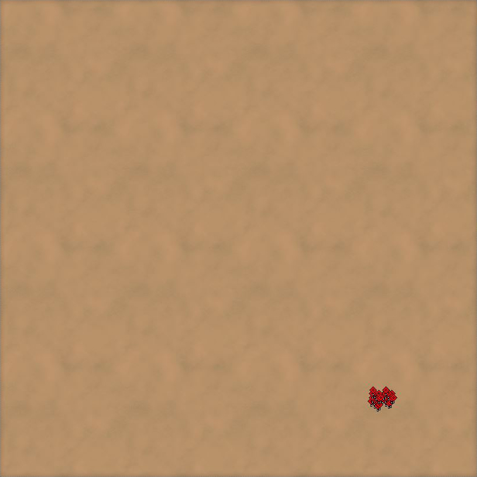
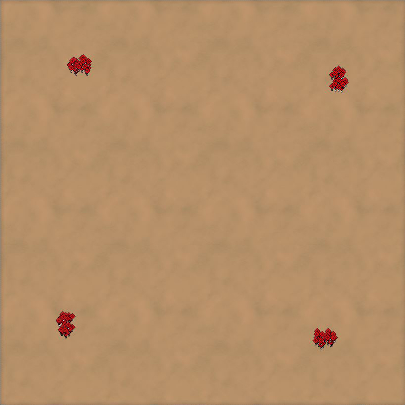
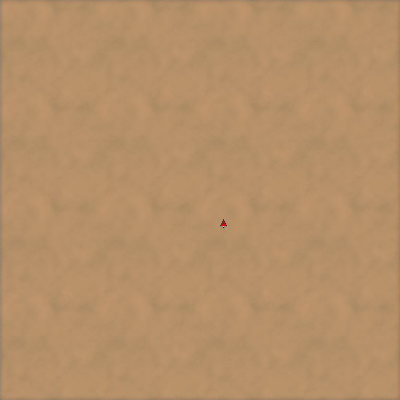
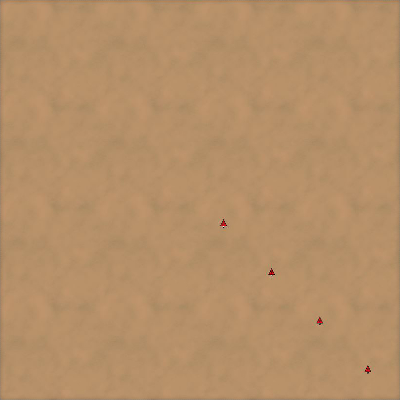
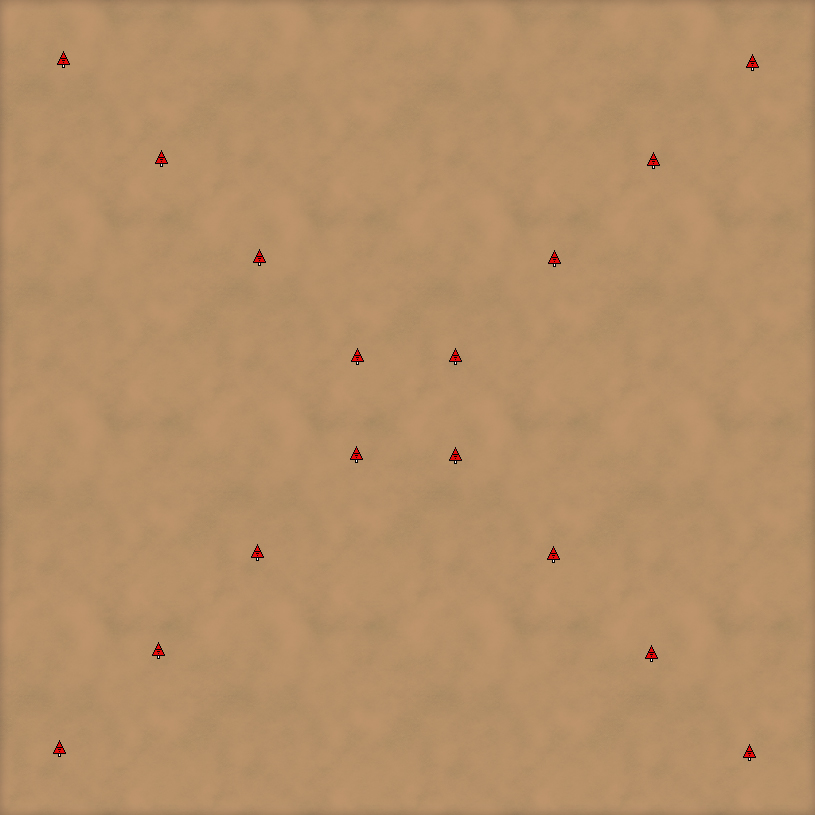

# mulin-transform

A script to facilitate transforming marker and unit positions of *Supreme Commander* maps.


## Overview

The script *transform.lua* applies linear transformations to markers and units stored in the form of a lua table in a file (typically `<mapname>_save.lua`). The transformations supported so far are:

* **rotation**    : rotates markers or units around a specified point on the map by a given angle
* **projection**  : projects markers or units from a specified point by a given factor
* **translation** : translates units or markers in a given direction by a given distance 

All transformations will be performed on the horizontal plane. Enable *auto snap to land layer* in your map editor to make all transformed objects accquire ground level height again after loading the map with the data output from this script! You might need to select all objects that were transformed and move them 1 field in any direction and then back again for land layer snap to engage. The output of this script will look a little messed up, but the map editor will process it jut fine; and once you save your map, the file will be correctly formatted again.


## Requirements

You need the LUA interpreter. For Windows find the executable here: https://www.lua.org/download.html
Under macOS you can use brew to install the interpreter: `$ brew intall lua`. Under Linux running APT package manager you can execute `$ apt-get install lua5.3`.


## Usage

Invoke the script with the file containing the marker and unit data (this will normally be `<mapname>_save.lua`) and redirect the ouput into a new file (or the same). Then replace the old file in the folder of your map. Make sure the new file has the same name as the old one (that is `<mapname>_save.lua`).

This is the synopsis of the script:
```
Usage: mulin-transform.lua [--rotate <degrees> <point>]
       [--project <factor> <point>]
       [--translate <degrees> <magnitude>] [-m] [-u] [-t <times>] [-c]
       [-h] <file>

Applies linear transformations (rotation, projection, translation) to objects specified in an input file (<map name>_save.lua).

Arguments:
   file                  input file (e.g. MyMap_save.lua)

Options:
   --rotate <degrees> <point>
                         rotate objects by angle around point
   --project <factor> <point>
                         project objects by factor from point
   --translate <degrees> <magnitude>
                         translate objects by vector
   -m, --markers         Apply transformation to markers.
   -u, --units           Apply transformation to units.
   -t <times>, --times <times>
                         number of times to apply transformation (default: 1)
   -c, --copy            Copy objects each transformation.
   -h, --help            Show this help message and exit.
```


## Examples

Say we have a 512x512 sized map. We want our map to be 4 way rotationally symmetric. So far we have put down a few units that we want to spawn as reclaim:



Then we execute the following command to apply 3 rotations of 90 degrees (accumulatively) and copying the units every time:

`lua path/to/mulin-transform.lua path/to/mymap_save.lua  -uct3 --rotate 90 "256, 256" >| path/to/mymap_save.lua`

We reload our map in the editor and find that our units have been correctly copied and rotated:



Say we want to project this unit 3 times from the center by a factor of 2:



We use this command:

`lua path/to/mulin-transform.lua path/to/mymap_save.lua  -uct3 --project 2 "256, 256" >| path/to/mymap_save.lua`

and end up with this:



We can also compose transformations. Say we want to rotate this unit 3 times by 90 degrees and also again project it 3 times by a factor of 2 times. For that we invoke the script like this:

`lua path/to/mulin-transform.lua math/to/mymap_save.lua -uct3 --project 2 "256, 256" --rotate 90 "256, 256" >| path/to/mymap_save.lua`




# TODO

- Adjust units' orientation after rotation
- make *times* option local to individual transformation
